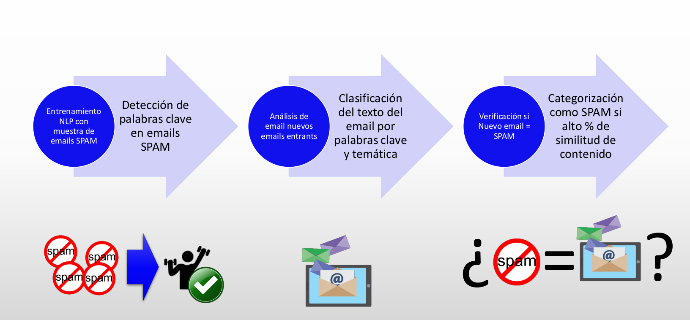
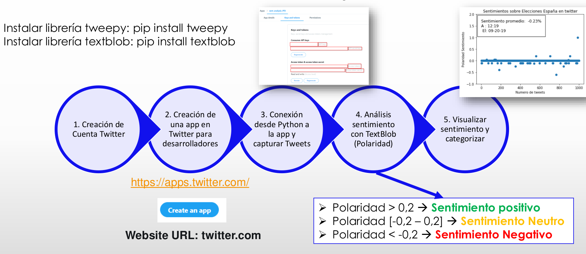

# 1-Sistema-Clasificación-Textos
1. [Instalación librería NLTK](#schema1)
2. [Caso Práctico Clasificación Textos – Tokenizar](#schema2)
3. [Ánalisis de Sentimientos](#schema3)


<hr>

<a name="schema1"></a>


## 1. Instalación librería NLTK

1. Creación de un entorno virtual:
```bash
virtualenv mi_entorno
```
2. Activación del entorno virtual:
```bash
source mi_entorno/bin/activate

```
3. Instala NLTK:
```bash
pip install nltk

```

4. Instalar los paquetes de NLTK

```python
import nltk
nltk.download(all)
```
<hr>

<a name="schema2"></a>

## 2. Caso Práctico Clasificación Textos – Tokenizar

Análisis página web: https://es.wikipedia.org/wiki/Finanzas
### **1.Tokenizar Texto:**

Dividir el texto en “tokens”, es decir, piezas más pequeñas (se puede tokenizar por palabraso por sentencias)

  La casa de Juan es blanca --> La - casa – de – Juan - es – blanca (6 Tokens)
  
  Crear tokens por palabras, con `word_tokenize`hacemos la division del texto en tokens.
  ```python
    from nltk.tokenize import word_tokenize
    tokens = word_tokenize(text,"spanish")
    tokens=[word.lower() for word in tokens if word.isalpha()] # Remover los signos de puntuación
    print(tokens)
  ```

### **2.Eliminar Palabras de Parada**

Eliminar palabras poco relevantes para la información del texto (artículos, preposiciones,…)
La - casa – de – Juan - es – blanca-- > casa – Juan - es – blanca
```python
from nltk.corpus import stopwords

clean_tokens = tokens[:]
for token in tokens:
    if token in stopwords.words('spanish'):
        clean_tokens.remove(token)
```

### **3. Obtener Sinónimos /Antónimos**

- **WordNet** es una base de datos dentro de NTLK creada para el procesamiento del lenguaje natural.
Incluye grupos de sinónimos y una breve definición. Solo funciona para el idioma ingléss
- Los **sinónimos** permiten agrupar términos similares para computar conjuntamente la frecuencia de
palabras y su clasificación (Ej: calcular <--> estimar)
- Los **antónimos** permite evaluar el contrapeso de cada palabra (útil para evaluar sentimientos,
ejemplo éxito <--> fracaso)

```python
from nltk.corpus import wordnet
```

### **4.4.Derivación regresiva con NLTK (Word Stemming)

- La derivación regresiva se utilizar para encontrar la palabra raíz eliminando afijos (prefijos o sufijos).
- Permite optimizar la agrupación y clasificación de textos.
- El algoritmo más utilizado es el algoritmo Porter de derivación regresiva.

```python
from nltk.stem import PorterStemmer
```

`PorterSteemer` solo para el idioma inglés

```python
from nltk.stem import SnowballStemmer
```

`SnowballStemmer` para español


### **5.Palabras lematizadoras usando WordNet /Spicy**
- Lematizar palabras es similar a la derivación regresiva, pero lo que hace es hallar el lema correspondiente a partir de una forma flexionada (plural, verbo conjugado, femenino, masculino,…) pero, la diferencia es el que la lematización es el mundo real


- La derivación funciona con palabras sin conocer su contexto y es por eso que la raíz tiene una precisión
menor, pero, es más rápida que la lematización.
- La ventaja de la lematización frente a la derivaciónes que devuelve una palabra real.
- Si se precisa velocidad --> Derivación
- Si se necesita precisión --> Lematización

```python
from nltk.stem import WordNetLemmatizer
```
`WordNetLemmatizer` solo inglés
```python
import spacy
nlp = spacy.blank('es')
```
`spacy` español


### **6. Filtro Spam**



<hr>

<a name="schema3"></a>

## 3. Ánalisis de Sentimientos

### **1. ¿En qué consiste el Análisis de Sentimientos?**
- Comprender y analizar la respuesta de las personas descubriendo opiniones, emociones y sentimientos sobre un producto, servicio o entidad (mayoritariamente de redes sociales con alto volumen de respuestas).
- Se basa en el Procesamiento del Lenguaje Natural y la estadística asignando valores al texto (positivo, negativo o neutral). Con ello, identificar el sentimiento global (contento, triste,enfadado,…)

- Alta aplicación para:

  - Identificar la respuesta a mensajes de negocio de las empresas
  - Reajuste de la estrategia de negocio
  - Diseñar una mejor experiencia de cliente
  - Mejorar el producto o servicio
  - Análisis de la percepción de marca
  - Predicción de movimientos en bolsa

### 2. Caso Práctico


Necesitamos:

```python
pip install tweepy
pip install textblob
```